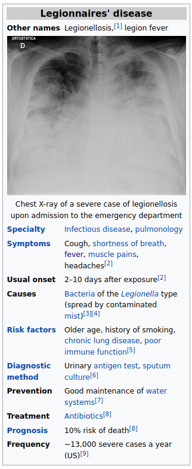
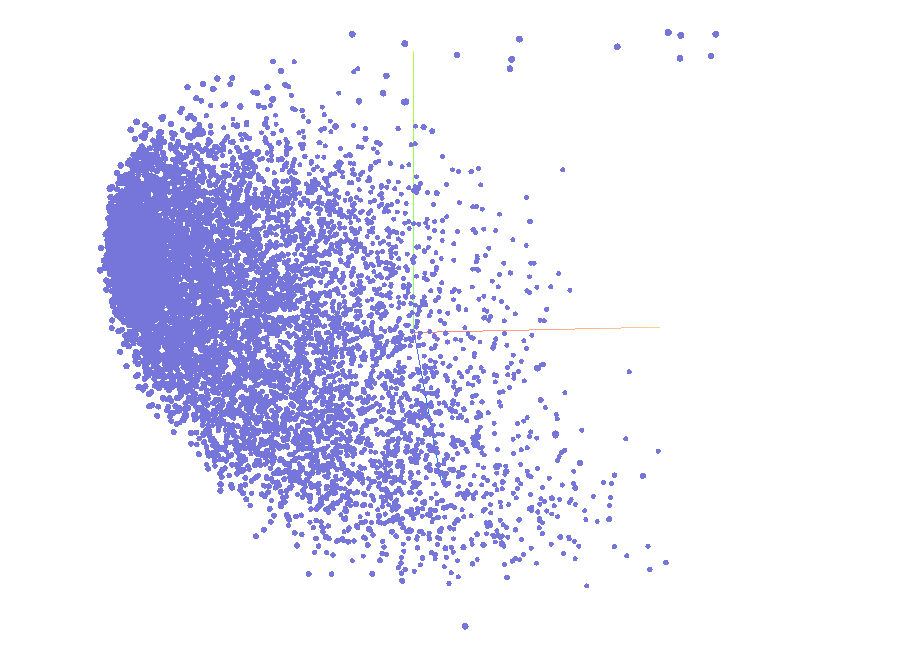

# Clinical Disease Embedding
A project to convert clinical diseases in wikipedia articles to vector embeddings.

# Usage

## Install dependencies

Install all dependencies with pip:
`pip install -r requirements.txt`

Bzcat is also required. https://command-not-found.com/bzcat

## Download wikipedia dumps with

`python -m src.download_wikipedia --download-path <download_path> --dump-name <dump_name>`

dump_name must be one of the dumps available at: https://dumps.wikimedia.org/enwiki/

Example:
`python -m src.download_wikipedia --download-path /home/gonzalo/wiki_data/bz2 --dump-name 20220901`

## Methodology

I followed the methodology explained in this article:
https://towardsdatascience.com/neural-network-embeddings-explained-4d028e6f0526

I downloaded all wikipedia articles for clinical conditions. That is, articles that contain the infobox template for "medical condition". As an example, this is the infobox for (Legionnaires' disease)[https://en.wikipedia.org/wiki/Legionnaires%27_disease].



I extracted information from the articles including title, internal wikipedia links (wikilinks), external links, etc.

The hypothesis to create the embeddings is that similar diseases will point to similar articles. I fed pairs of $x=[disease, link]$ samples to a NN with their corresponding label $y=1/-1$. (1 meaning that the given disease's article has the given link and -1 that the article doesn't contain the link).

After training, I extracted the weights from the embedding layer. The [model notebook](src/notebooks/model.ipynb) contains all the necessary code to train the NN.
## Results - November 7th 2022



The resulting embedding can be visualized at. This embedding was built with about 8.7k articles from wikipedia that contain the template for "medical condition" (https://en.wikipedia.org/wiki/Template:Infobox_medical_condition).

There should be a total of 9800 articles with the template and I'm currently in the process of re-downloading wikipedia and generating the embeddings again.

[model notebook](src/notebooks/model.ipynb)

Some results:

```
Articles closest to Parkinson's disease.

Article: Parkinson's disease             Similarity: 1.0
Article: Alzheimer's disease             Similarity: 0.95
Article: Dementia with Lewy bodies       Similarity: 0.95
Article: Huntington's disease            Similarity: 0.91
Article: Dementia                        Similarity: 0.91
Article: Amyotrophic lateral sclerosis   Similarity: 0.9
Article: Tourette syndrome               Similarity: 0.89
Article: Autism spectrum                 Similarity: 0.88
Article: Epilepsy                        Similarity: 0.88
Article: Schizophrenia                   Similarity: 0.84
Article: Temporal lobe epilepsy          Similarity: 0.84
Article: Neurological disorder           Similarity: 0.84
Article: Addiction                       Similarity: 0.83
Article: Opioid use disorder             Similarity: 0.83
Article: Fibromyalgia                    Similarity: 0.82

```

```
Articles closest to Sepsis.

Article: Sepsis                                          Similarity: 1.0
Article: Pneumonia                                       Similarity: 0.9
Article: Multisystem inflammatory syndrome in children   Similarity: 0.9
Article: COVID-19                                        Similarity: 0.88
Article: Leptospirosis                                   Similarity: 0.86
Article: Chronic obstructive pulmonary disease           Similarity: 0.85
Article: Septic shock                                    Similarity: 0.84
Article: Kawasaki disease                                Similarity: 0.84
Article: Myocardial infarction                           Similarity: 0.83
Article: Cirrhosis                                       Similarity: 0.81
Article: Pathogenic bacteria                             Similarity: 0.81
Article: Heart failure                                   Similarity: 0.81
Article: Cholera                                         Similarity: 0.8
Article: Dengue fever                                    Similarity: 0.8
Article: Inflammation                                    Similarity: 0.8

```

The full embedding can be explored here:s
https://projector.tensorflow.org/?config=https://downloads.gonzalohernandezmunoz.com/clinical-disease-embedding/config.json